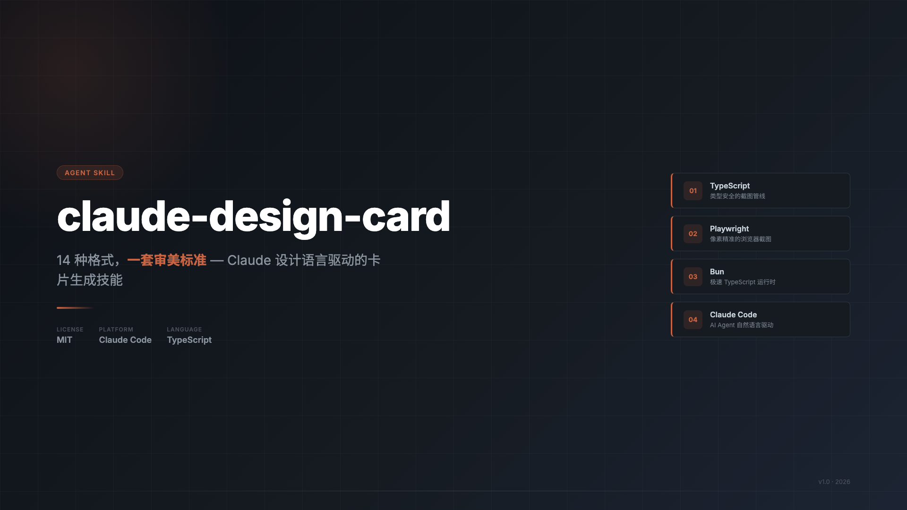
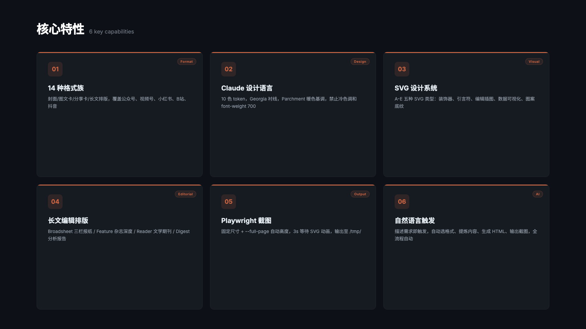
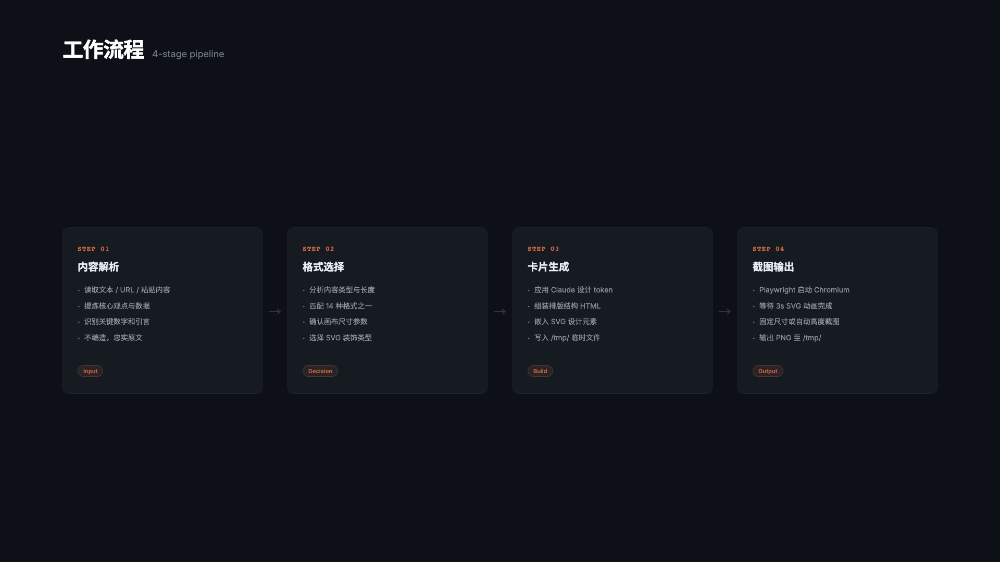

<div align="center">

# design-card

**14 种格式 × 8 套主题配色 — Claude 设计语言驱动的卡片生成技能**



[](./LICENSE)
[](https://www.typescriptlang.org/)
[](https://bun.sh/)
[](https://playwright.dev/)

</div>

---

## 这是什么

将任意文本、网页或 URL 转化为精致的可发布卡片，覆盖平台封面、社交分享、长文编辑排版。所有卡片遵循 [Claude/Anthropic 设计系统](DESIGN.md) 的排版纪律（Georgia 衬线、书籍级行高、印刷 SVG 系统），并在此之上提供 **8 套可选主题配色**——颜色抽象成 10 个语义 token，换主题只改 `:root` 一段，排版结构零改动。主题定义见 [`references/THEMES.md`](references/THEMES.md)。

**内置主题**：`claude`（陶土·默认）· `newsroom`（报刊红）· `indigo`（靛蓝）· `forest`（森林墨）· `kraft`（牛皮纸）· `dune`（沙丘）· `midnight`（深色·橙）· `blueprint`（深色·蓝图）。


👉 **[主题预览画廊 →](samples/)**（8 套主题各一张大图样例卡 + 调色板 hex，方便挑选）

```
输入：一段文字 / URL / 数据（+ 可选主题名）
输出：/tmp/design-card-*.png（像素精准的设计卡片）
```

---

## 核心特性



---

## 工作流程



---

## 环境依赖

| 依赖 | 版本 | 说明 |
|------|------|------|
| [Bun](https://bun.sh) | ≥ 1.0 | 运行时 & 包管理器 |
| [Playwright](https://playwright.dev) | ≥ 1.59 | Chromium 截图引擎 |
| TypeScript | ≥ 5.0 | 脚本语言（Bun 原生支持） |
| Node.js | — | 仅 `npx skills add` 安装时需要 |

---

## 安装

**作为 AI Skill（推荐）：**

```bash
npx skills add https://github.com/upwon/design-card
```

> 本仓库是 [geekjourneyx/claude-design-card](https://github.com/geekjourneyx/claude-design-card) 的 fork，新增了 8 套主题配色系统。

**本地开发：**

```bash
bun install
bunx playwright install chromium
```

---

## 快速上手

```bash
# 固定尺寸（平台封面、内容卡）
bun scripts/screenshot.ts <input.html> [output.png] [width] [height]

# 自动高度（长文编辑排版）
bun scripts/screenshot.ts <input.html> [output.png] [width] --full-page
```

示例：

```bash
# 公众号首图 900×383
bun scripts/screenshot.ts /tmp/card.html /tmp/cover.png 900 383

# 小红书图文笔记 1080×1440
bun scripts/screenshot.ts /tmp/card.html /tmp/xiaohongshu.png 1080 1440

# The Broadsheet 长文排版（自动高度）
bun scripts/screenshot.ts /tmp/broadsheet.html /tmp/broadsheet.png 800 --full-page

# 省略输出路径 → /tmp/claude-card-<basename>.png
bun scripts/screenshot.ts /tmp/my-card.html
```

---

## 支持格式

### 格式族 A — 平台封面

平台封面现在按「点击前承诺」设计：一个强判断标题、一句承接、一个证据点，而不是正文摘要。

| 格式 | 尺寸 | 用途 | 设计重点 |
|------|------|------|------|
| 公众号首图 | 900 × 383 px | 微信公众号文章封面 | 横向秒读，左标题右证据 |
| 视频号竖封面 | 1080 × 1440 px | 微信视频号封面 | 竖版海报，中部标题锚点 |
| B站/YouTube 横封面 | 1280 × 720 px | B站、YouTube 缩略图 | 缩略图路牌，关键词清晰 |
| 抖音全屏竖版 | 1080 × 1920 px | 抖音、TikTok 封面 | 全屏停顿，安全区内一个判断 |

### 格式族 B — 图文内容卡

图文内容卡现在按「可保存的知识物件」设计：首图停留，内页理解，工具页收藏。

| 格式 | 尺寸 | 用途 | 美学模式 |
|------|------|------|------|
| 小红书图文笔记 | 1080 × 1440 px | 小红书主图 / 轮播 | Editorial Artifact + Dark Magazine Cover |
| 步骤教程卡 | 1080 × 1440 px | 教程类内容 | Practical Toolkit |
| 对比分析卡 | 1080 × 1440 px | 对比 / 竞品分析 | Editorial Artifact |

### 格式族 C — 社交分享卡

| 格式 | 尺寸 | 特征 |
|---|---|---|
| 金句分享卡 | 1080 × 1080 px | 大号引言符，极简单栏 |
| 数据大字卡 | 1080 × 1080 px | 超大数字主导，SVG 进度条 |
| 方形通用卡 | 1080 × 1080 px | 标准单栏，灵活适配 |

### 格式族 D — 长文编辑排版

| 格式 | 宽度 | 气质 |
|---|---|---|
| The Broadsheet | 800 px | 三栏报纸，版刻装饰，Drop Cap |
| The Feature | 760 px | 杂志深度，暗头双栏，边侧栏 |
| The Reader | 720 px | 文学期刊，Marginalia 边注 |
| The Digest | 760 px | 分析报告，摘要框 + 数据列 |

---

## 设计系统

所有卡片颜色抽象成 **10 个语义 Token**，取值来自选中的**主题**（见 [主题预览](samples/) 与 [references/THEMES.md](references/THEMES.md)）。换主题只替换 `:root` 一段，正文样式零改动。下表为默认主题 `claude` 的取值：

| Token | 语义 | claude 默认值 |
|---|---|---|
| `--pg` | 主背景 | `#f5f4ed` |
| `--iv` | 卡面/次背景 | `#faf9f5` |
| `--nk` | 正文、标题（墨色，亮/暗随主题） | `#141413` |
| `--ds` | 深色区块（**永远深色**） | `#30302e` |
| `--ws` | `--ds` 上的文字（**永远浅色**） | `#b0aea5` |
| `--tc` | 强调、装饰 | `#c96442` |
| `--og` | 副文本 | `#5e5d59` |
| `--sg` | 元信息 | `#87867f` |

`--ds` 恒深 + `--ws` 恒浅 → 深色头部构图在每套主题（含深色主题）都成立。
字体：Georgia（衬线，标题/正文）+ system-ui（UI/标签）。颜色一律走 `var(--x)`，不写死 hex、不用纯白 `#ffffff`、不用 `font-weight: 700`。

新增 A/B 族社交设计原则：

- **A 族平台封面**：封面负责点击，不替代正文。
- **B 族内容卡**：内容卡负责停留、理解和收藏。
- **抖音/故事**：按全屏停顿设计处理，避开顶部、底部和右侧平台 UI。
- **小红书/图文**：首图像封面，内页像高级编辑手册或实用工具卡。

---

## 作为 AI Skill 使用

在 Claude Code 中安装后，通过自然语言描述触发：

```
帮我把这篇文章做成小红书图文笔记卡片
把这个数据做成方形分享卡，用 blueprint 主题
帮我生成一张公众号首图封面，森林墨风格
把这篇长文做成 The Broadsheet 编辑排版，newsroom 报刊主题
```

技能自动完成：分析内容 → 选择格式 → 提炼关键信息（不编造）→ 生成 HTML → 截图输出至 `/tmp/`。

---

## 许可证

[MIT](./LICENSE) — 自由使用、修改、分发。

---

## 关于作者

| | |
|:---|:---|
| 个人主页 | [jieni.ai](https://jieni.ai) |
| GitHub | [geekjourneyx](https://github.com/geekjourneyx) |
| Twitter | [@seekjourney](https://x.com/seekjourney) |
| 公众号 | 微信搜「极客杰尼」 |
